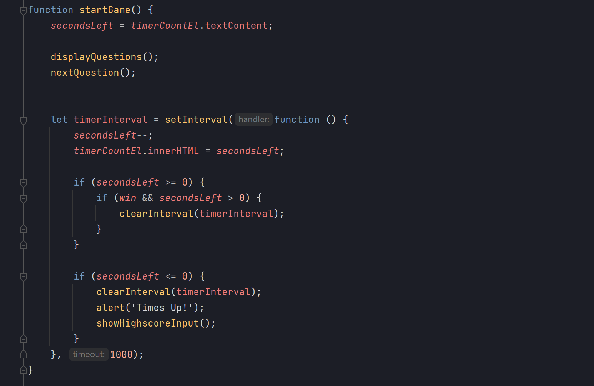
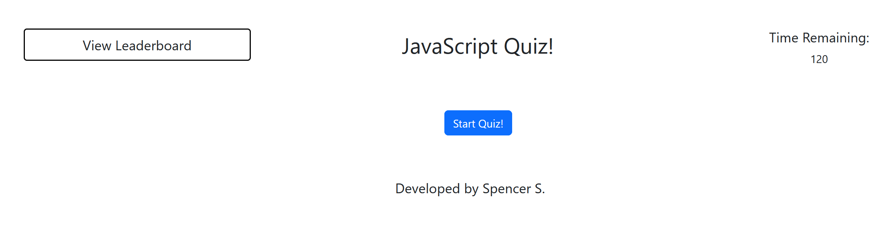

# Coding-Quiz
Module 4 Challenge - KU Bootcamp
---
# Password Generator - Module 3 Challenge

## Table of Contents

- [Description](#description)
- [Installation](#installation)
- [Usage](#usage)
- [Credits](#credits)
- [License](#license)
- [Code Example](#Code-Example)
- [Live Site](#Live-Site)

## Description
For this project, I have built from scratch a website for a code quiz.

## Installation

(No installation required)

## Usage

Click "Start Quiz!" to start.
Click "View Leaderboard" to show the leaderboard (will be locked during quiz).

Feel free to inspect the code! To open the Chrome DevTools,
try pressing Command+Option+I (macOS) or Control+Shift+I (Windows) while viewing the hosted site from within
Google Chrome.

## Credits

Developed by Spencer Stewart.

Personal links:
[GitHub](https://github.com/SpencerRSMS/)
[LinkedIn](https://www.linkedin.com/in/r-spencer-stewart/)

## License

Please refer to the LICENSE file for more information.

## Features

- Leaderboard to view high scores.
- Quiz game.
- Input for latest high score.
- Local storage of high scores.

[GitHub repository](https://github.com/SpencerRSMS/Coding-Quiz).

## Code-Example
#### Some Code Snippets:

## Live-Site
#### Click [here](https://spencerrsms.github.io/Coding-Quize/) for the [live site](https://spencerrsms.github.io/Coding-Quiz/)!
